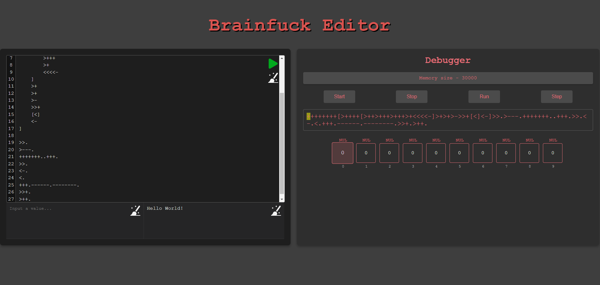

# Laboratory work #4
## Brainfuck Editor

## [Link to the design document](https://docs.google.com/document/d/1tOXQjWUA8VQA8GhuJndz-iTPrESmXg4r3Ipj1Rp2qVg/edit?usp=sharing)

### Our team:

- [Kobziev Daniil](https://t.me/Sevenpointnine) - Team lead and Back-end developer
- [Katynskyi Illya](https://t.me/girostark) - Front-end developer
- [Yukhymenko Stas](https://t.me/stas_yukhymenko) - Fullstack - developer

### Short description

The project consists in creating an interpreter for the Brainfuck programming language, which is known for its extreme minimalism and complexity. This language uses only eight commands to manipulate data in an array and control the flow of program execution. The purpose of the interpreter is to provide a tool that can execute programs written in Brainfuck, as well as provide users with a convenient interface for testing and debugging their programs. This project will contribute to the understanding of the principles of interpreters and features of low-level programming.



## How to set up project

#### Front-end (React + TypeScript)

1. [Download node.js (version 20 or higher)](https://nodejs.org/en/download/prebuilt-installer)
2. Run ```npm install``` in project`s root directory
3. Run ```npm run dev``` to launch front-end part
4. Visit http://localhost:5173/ to see best desing you can imagine

#### Back-end (Java)

1. [Download JDK 17+](https://www.oracle.com/cis/java/technologies/downloads/)
2. [Download Gradle](https://gradle.org/install/)
3. Run ```./gradlew bootRun``` to start server

How to run test?

- Run ```./gradlew test``` to start tests

## Short Brainfuck tutorial

Brainfuck is an esoteric programming language created by Urban Müller in 1993. It is known for its minimalistic and challenging nature, using only eight commands. This tutorial will cover the basics of Brainfuck, including its commands, a simple "Hello World" program, and some practice exercises.

Brainfuck operates on an array of memory cells, each initially set to zero. A pointer starts at the first cell and can be moved and modified using the following commands:

- `>` : Move the pointer to the right.
- `<` : Move the pointer to the left.
- `+` : Increment the memory cell at the pointer.
- `-` : Decrement the memory cell at the pointer.
- `.` : Output the character at the pointer.
- `,` : Input a character and store it in the cell at the pointer.
- `[` : Jump forward to the command after the corresponding ] if the cell at the pointer is zero.
- `]` : Jump back to the command after the corresponding [ if the cell at the pointer is non-zero.

**"Hello World" Example**

Here is a simple "Hello World!" program in Brainfuck:

```
++++++++  
[
    >++++ 
    [   
        >++    
        >+++  
        >+++     
        >+            
        <<<<-   
    ]       
    >+            
    >+                  
    >-                
    >>+            
    [<]        
    <-     
]       

>>.  
>---.   
+++++++..+++.    
>>.    
<-.  
<. 
+++.------.--------.  
>>+. 
>++.
```

### Debugger overview

- Press `Start` to start (wow) debugger 
- Press `Stop` to stop (omg) debugger 
- Press `Run` to run code immediately
- Press `Step` to see how memory changes step by step

Enjoy! ;)
